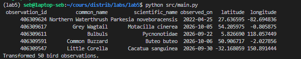
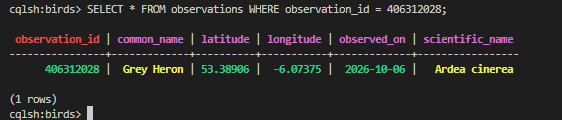
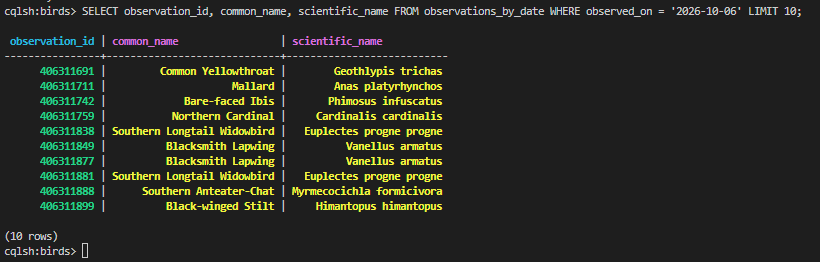

# TP Cassandra — Observations d’oiseaux

## Sujet et API

Le sujet est l’observation des oiseaux. Les données proviennent de l’API iNaturalist : `https://api.inaturalist.org/v1/observations?taxon_id=3&per_page=50`. Le pipeline récupère des observations du taxon Aves et conserve six champs : `observation_id`, `common_name`, `scientific_name`, `observed_on`, `latitude` et `longitude`. Les coordonnées peuvent être absentes ou masquées par l’API.

## Modèle Cassandra

Le keyspace est `birds`. Le projet alimente cinq tables, chacune adaptée à un besoin de lecture :

- `observations` : lecture directe par `observation_id` (clé de partition) ;
- `observations_by_species` : lecture des observations récentes d’une espèce ;
- `observations_by_species_date` : lecture d’une espèce à une date précise ;
- `observations_by_date` : lecture de toutes les observations d’une date ;
- `observations_by_common_name` : lecture par nom commun, des plus récentes aux plus anciennes.

Les définitions sont dans [`queries/01_schema.sql`](queries/01_schema.sql) et la justification détaillée des clés dans [`documentation/modelisation.md`](documentation/modelisation.md).

## Exécution

```bash
uv sync
# Dans Docker Compose, le service extractor lance le job périodiquement.
docker compose up -d --build
```

Pour déclencher une ingestion immédiatement dans le conteneur :

```bash
docker compose exec extractor /usr/local/bin/run-extractor
```

## Requêtes

Les exemples de consultation, insertion, modification et suppression sont dans [`queries/02_crud.sql`](queries/02_crud.sql). Cinq besoins métier et leurs requêtes sont dans [`queries/03_requetes_metier.sql`](queries/03_requetes_metier.sql).

L’ingestion duplique volontairement les données dans les tables de requêtes Cassandra. Les écritures répétées sont idempotentes grâce aux clés primaires, mais les écritures multi-tables ne constituent pas une transaction atomique.

## Captures d'écran:

Format des données transformées:


Observation par l'identifiant


Observations par date
